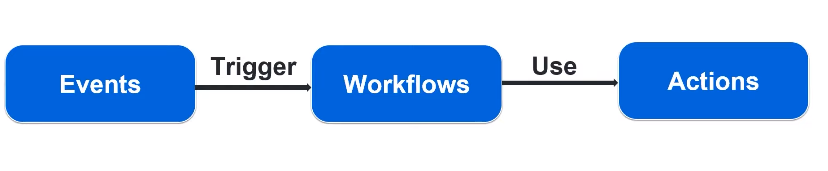

## Key Terminology

1) Workflow
    - A YAML file within your repo, which is a automated process that will run one or more jobs one defined events
    - placed in .github/workflows dir
    - we can have more than one workflows

2) Event
    - An activity that triggers a workflow.
    - It can be push, merge request... etc

3) Job
    - A task in a workflow.
    - We can have multiple jobs
    - All jobs needs to be successful to make a workflow successfulA smaller task that is executed within a job. All steps must be completed in order to complete a job.

4) Step
    - A smaller task that is executed within a job. All steps must be completed in order to complete a job.
    
5) Action
    - A standalone command performed in a step
    
6) Runner
    - A server that runs your workflows when they’re triggered

## Jenkins Equivalent terms

<pre>
GitAction      Jenkins
--------    -----------
Workflow <=> Pipeline
Event    <=> BuildTriggers
Job      <=> Stages
Step     <=> Steps
Action   <=> Jenkins/Groovy commands
Runner   <=> sh() or bat()

</pre>

## Github Actions

## Types of Actions

1) Docker containe
2) JavaScript
3) Composite Actions

